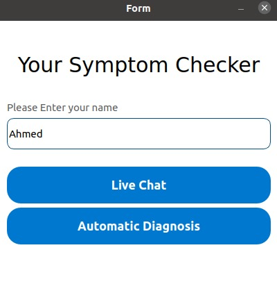
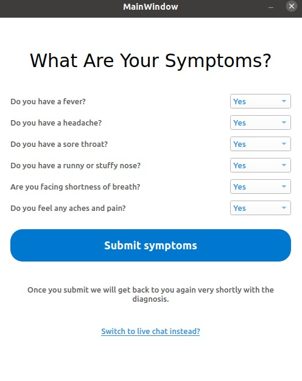
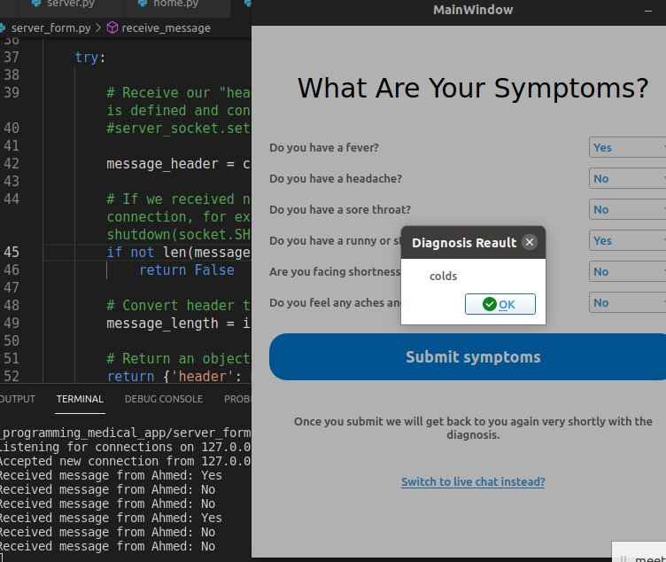
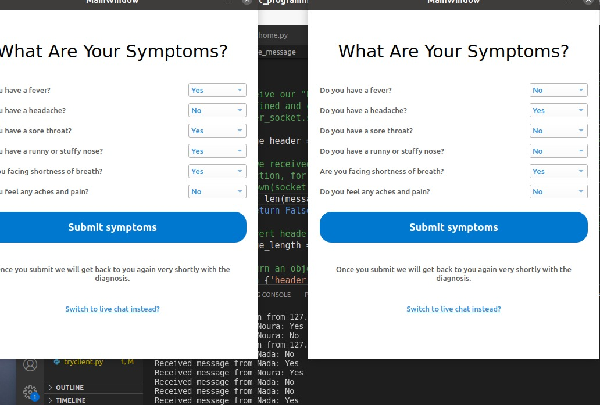
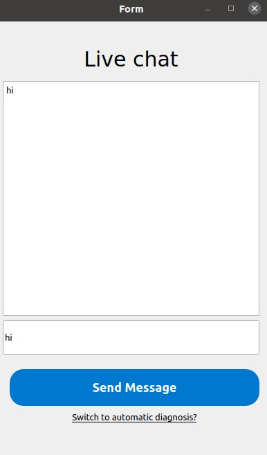
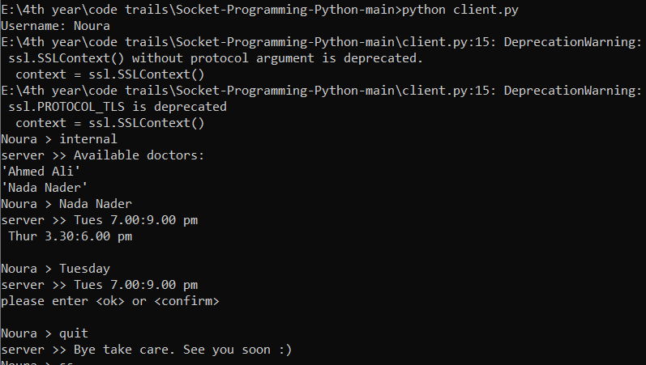

# Socket Programming Project

## Team members:
* Radwa Saed
* Marwa Abdelaal
* Meirna Kamal
* Nada Ezzat
* Noura Mahmoud
* Walaa Salah

## Diagnostic form:

* Be sure you are in the main directory and you have all files and certifications for sercuirity

To run the home which contains form and chat_bot

run:


```
>> python server_form.py 
>> python home.py
```





* you can run many clients </br>

</br></br></br></br></br>


## Chat_bot:


* We have a problem in chat_bot with this version, it doesn't behave proberly after linking it with the code

* To see the impact of chat_bot through the terminal, 
run:

```
>> python server.py      
>> python client.py   
```
Enter username




## problem:
we have a problem in timeout function,It never works, we tried a lot.


## [Link to Video](https://drive.google.com/drive/folders/1HtDZIkOgGecknsO6Z0xJd_9TViC4ZqFi?usp=sharing)

## [Link to Repo](https://github.com/Noura-Mahmoud/Socket_programming_project)
